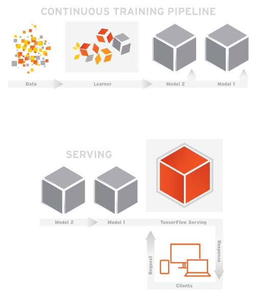

# Tensorflow serving (cpu)

official introduce: <https://www.tensorflow.org/serving/>



## Component

* Bazel 0.5.4
* grpc 1.6.0
* Python 3.5
* Python 2.7
* Tensorflow 1.3.0
* Tensorflow Serving 1.3.0

## Usage

> Tensorflow Serving - Server
```bash
docker run -it -v <client>:/client -p 9000:9000 --name <ts_server> baikangwang/tensorflow_serving_cpu /bin/bash 
```
> Tensorflow Serving - Client

```bash
# console, desktop program
docker run -it -v <client>:/client --name <ts_client> baikangwang/tensorflow_serving_cpu /bin/bash
 
# web app
docker run -it -v <client>:/client -p 8080:8080 --name <ts_client> baikangwang/tensorflow_serving_cpu /bin/bash
```

> `<client>`: it's a placeholder presenting the client code directory  
> `<ts_server>`: it's a placeholder presenting the container name being played as _SERVER_ role  
> `<ts_client>`: it's a placeholder presenting the container name being played as _CLIENT_ role  
> `9000:9000`: the serving service port, the server part is configurable with the evn variable `$SERVING_PORT`  
> `8080:8080`: the client app port which is optional for console, desktop programs, the server part is configurable with the evn variable `$CLIENT_PORT`  

## Tensorflow serving tasks

### Run Server

```bash
tensorflow_model_server --port=9000 --model_name=<model_name> --model_base_path=/client/<trained_model_path>
```

### Run Client

> console, desktop program

```bash
# must use Python2 run the predict program since grpc still dosen't support Python3
python /client/<predict.py> --<args>=... --server=localhost:9000
```

> web app

```bash
# must use Python2 run the predict program since grpc still dosen't support Python3
python /client/<web_predict_host.py> --<args>=... --server=localhost:9000 --port=8080
```

### Example

Take the tensorflow serving tutorial, [Serving a TensorFlow Model](https://www.tensorflow.org/serving/serving_basic) for example,
This tutorial introduce how to serving a trained model through bazel build, but in this image the tensorflow serving installed using binary so the code needs a little bit of updates,
see [baikangwang/MNIST](https://github.com/baikangwang/MNIST) for updated codes.

#### Prerequisites
```bash
cd /
git clone git@github.com:baikangwang/MNIST.git
ls -lsa /MNIST
```

#### Create Container

> Server

```bash
docker run -it -v /MNIST:/client -p 9000:9000 --name ts_server baikangwang/tensorflow_serving_cpu /bin/bash
```

> Client

```bash
docker run -it -v /MNIST:/client --name ts_client baikangwang/tensorflow_serving_cpu /bin/bash
```

#### Run

> Server

```bash
tensorflow_model_server --port=9000 --model_name="mnist" --model_base_path="/client/models/"
```

> Client

```bash
python2 /client/mnist_predict.py --num_tests=1000 --server=localhost:9000 --data_dir=/client/input_data
```


