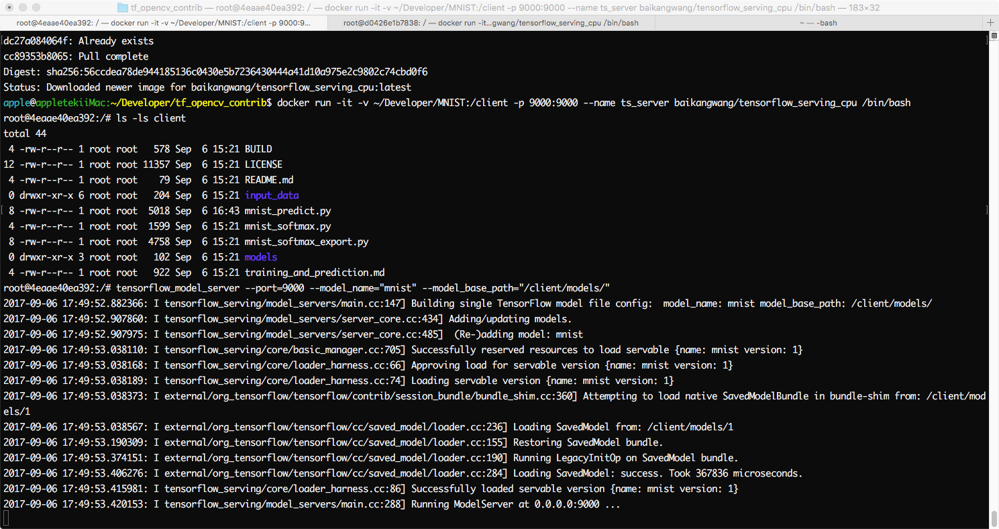
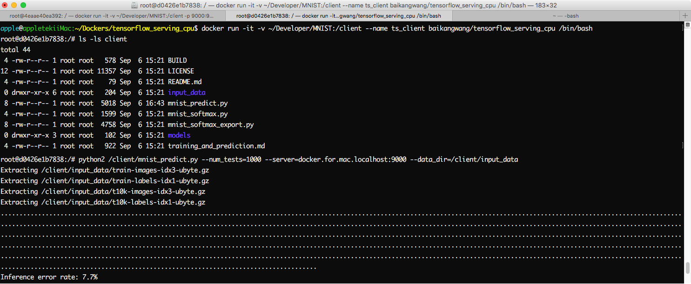

# Tensorflow serving Tutorials

## Run Server

```bash
tensorflow_model_server --port=9000 --model_name=<model_name> --model_base_path=/projects/<trained_model_path>
```

## Run Client

> console, desktop program

```bash
python[3] /projects/<predict.py> --<args>=... --server=localhost:9000
```

> web app

```bash
python[3] /projects/<web_predict_host.py> --<args>=... --server=localhost:9000 --port=8080
```

## Example

Take the tensorflow serving tutorial, [Serving a TensorFlow Model](https://www.tensorflow.org/serving/serving_basic) for example,
This tutorial introduce how to serving a trained model through bazel build, but in this image the tensorflow serving installed using binary so the code needs a little bit of updates,
see [baikangwang/MNIST](https://github.com/baikangwang/MNIST) for updated codes.

### Prerequisites
```bash
cd /
git clone git@github.com:baikangwang/MNIST.git
ls -lsa /MNIST
```

### Create Container

> Server

```bash
nvidia-docker run -it -v /MNIST:/projects -p 9000:9000 --name ts_server baikangwang/tensorflow_serving_gpu[:<tag>] /bin/bash
```

> Client

```bash
nvidia-docker run -it -v /MNIST:/projects --name --net=host ts_client baikangwang/tensorflow_serving_gpu[:<tag>] /bin/bash
```

### Run

> Server

```bash
tensorflow_model_server --port=9000 --model_name="mnist" --model_base_path="/projects/models/"
```



> Client

```bash
# Mac
python /projects/mnist_predict.py --num_tests=1000 --server=docker.for.mac.localhost:9000 --data_dir=/projects/input_data

# linux
python /projects/mnist_predict.py --num_tests=1000 --server=localhost:9000 --data_dir=/projects/input_data
```

